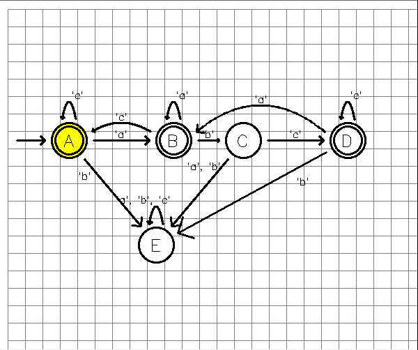

# Relatório

## Índice

[1. Introdução](#1-introdução)

[2. ADV - Visão Global e Documentação](#2-adv---visão-global-e-documentação)

[3. Classes de OpenCv em Python](#3-classes-de-opencv-em-python)

[4. Compilador, Interpretador e Análise Semântica](#4-compilador-interpretador-e-análise-semântica)

[5. Exemplos](#5-exemplos)

[6. Como executar](#6-como-executar)


## 1. Introdução

O objetivo deste projeto é permitir a criação de programas usando uma linguagem de programação ADV (Animation Description Language), que permite a criação de autómatos finitos. São disponiblizadas ferramentas que permitem a interação entre o utilizador e os autómatos e dão a possibilidade de formar animações com os mesmos.

Os autómatos são mecanismos de reconhecimento de palavras a partir de estados e inputs de caracteres. A partir de um estado inicial, o autómato vai percorrendo os estados seguintes, de acordo com os inputs que recebe, até chegar a um estado final. Se o estado em que o autómato se encontra no final da leitura da palavra for um estado final, então a palavra é reconhecida pelo autómato.

Para o desenvolvimento desta linguagem, usamos ANTLR4 para construção da árvore sintática, Java como linguagem de programação para criar um compilador para a linguagem ADV, Strings Templates para geração de código na linguagem Python usando as classes que construimos. Para a animação de autómatos, usamos a biblioteca OpenCV.

## 2. ADV - Visão Global e Documentação

Linguagem de desenvolvimento de desenhos e animações de autómatos.
Aqui apresentamos a documentação para o uso da nossa linguagem.

----- Documentação -----

**General**:

Todas as instâncias são separadas por ponto e vírgula.

Pode ser usado um ciclo for para percorrer repetidamente uma declaração, sendo definido da seguinte forma:

```
    for *variavel* in {{ *valor1*, *valor2*, *valor3*, ... }}
        *declaração*
```

```
    for s in {{ A, B, D }}
        s [accepting = true];
```

__Operators__:

| Type | Operator | Definition |
|:---:|:---|:---:|
| Comment | `//` | Comenta uma linha única |
| Comment | `/* */` | Comenta um bloco de linhas |
| Boolean/Arithmetic | `()` | Denota um grupo de operações |
| Artihmetic | `+` `-` | Operação de soma e diferença, usado entre números e pontos |
| Artihmetic | `*` `/` | Operação de multiplicação e divisão, usado entre números e pontos |

__Points__:

Pontos podem ser definidos pela notação cartesiana ou pelo notação polar.

| Notação Cartesiana | Notação Polar |
|:---:|:---:|
| `(x,y)` | `(r,θ)` |


Exemplos:
```
place A at (2,1);
point x1 = (200:0.6);
```

**Alphabet**:

Para instanciar um alfabeto usa-se a palavra "alphabet" seguida de um conjunto de símbolos entre chavetas, separados por vírgulas.
A definição do alfabeto é necessária para a utilização do programa.

```
    alphabet { *simbolo1*, *simbolo2*, *simbolo3*, ... }
```

```
    alphabet { 'a', 'b', 'c' }
```

**Automata Declaration**:

Para criar um autómato usa-se a palavra "NFA" (non-determinist finite automaton) ou "DFA" (determinist finite automaton) seguida de um nome para o autómato e de um conjunto de comandos entre brackets.
Adicionalmente pode-se usar a palavra "complete" para indicar o modo de um autómato como completo.

```
    NFA *automaton name* <<< **automaton commands** >>> 
    DFA *automaton name* <<< **automaton commands** >>>
    complete DFA *automaton name* <<< **automaton commands** >>>
    complete DFA *automaton name* <<< **automaton commands** >>>
```

```
NFA a1 <<<
  *automaton commands*
>>>
```

**State Declaration**:

Para declarar os estados que o automato pode ter, utiliza-se a instância 'state' seguida de uma lista de caracteres ou números, separados por vírgulas.

```
    state *simbolo1, simbolo2, simbolo3, ...*;
```

```
    state A, B;
```

**State Properties**:

A definição das propriedades é feita indicando, em primeiro lugar, o simbolo do estado e em seguida, entre parenteses retos, o nome da propriedade e o seu valor. As propriedades podem ser **'initial'** (estado inicial), **'accepting'** (estado final) ou **'highlighted'** (usado durante as animações para destacar o estado atual).

```
    *state* [initial = *true / false*];
    *state* [accepting = *true / false*]; 
    *state* [highlighted = *true / false*];
```

```
    A [initial = true];
    B [accepting = true];
    C [highlighted = true];
```

**Transition Declaration**:

Uma transição é definida indicando o estado de origem, seguido de uma seta, um conjunto de símbolos entre aspas e separados por vírgulas (que representam o valor das transições), uma seta, e por último, o estado de destino.

```
  *state* -> *simbolo1, simbolo2, ...* -> *state*;
```

```
  A -> 'a', 'b' -> B;
```

**View Declaration**:

Uma view mostra o autómato de uma forma gráfica, permitindo a visualização do utilizador. Para criar uma view, usa-se a palavra "view" seguida de um nome para a view e de um conjunto de comandos entre brackets.

```
    view *view* of *automaton* <<< **view commands** >>>
```

```
    view v1 of a1 <<<
        *view commands*
    >>>
```

**View Commands**:

**Place States**:

Para reproduzir os estados do autómato na view, usa-se a instância "place" seguida da referência ao estado, "at" e de um conjunto de coordenadas entre parenteses curvos, separados por vírgulas.

```
    place *state1, state2, state3, ...* at (*x1, y1*), (*x2, y2*), (*x3, y3*), ...;
```

```
  place A at (2,1), B at (5,1);
```

**Place Labels**:
Depois de indicar a localização dos estados na view, pode-se adicionar as transições entre os estados e a legenda (label) correspondente. Para tal usasse "place", uma referẽncia à transição, #label [align = above / below / left / right / (repetição)*] e "at" seguido de um ponto.

```
    place *state1 -> state2*#label [align = *above / below / left / right / +*] at *point*;
```

```
    place <B,A>#label [align = below] at pm;
```

_Locations_:
Também pode-se representar a transição por default (sem indicar um ponto de referência).
  
  ```
      *state1 -> state2*#label [align = *above / below / left / right / +*];
  ```

```
    <A,E>#label [align=below left];
    <D,E>#label [align=below right];
    <C,E>#label [align=right];
    <E,E>#label [align=left];
    
```

**Points Declaration**:

Na declaração de um point, existem algumas alternativas, podendo-o declarar isoladamente ou num conjunto, declará-lo com base em outros pontos ou declará-lo com base em coordenadas. Há ainda a possibilidade de realizar diretamente operações na sua declaração.

```
    point *point name*;
    point *point name* = (*point name* + *point name*) / *number* + (*number*, *number*);
    point *point name* = (*number*, *number*);
    point *point name* = (*angle*:*distance*);
```

```
    point p1;
    point p1, p2, pm;
    point x1 = (200:0.6); 
    point p2 = (A) + (-20:0.6); 
    point pm = (p1+p2)/2 + (0,0.2);
```

**Points Assignment**:

Na atribuição de um valor a um ponto se o mesmo já não for feito na sua declaração, são oferecidas diversas alternativas, correspondentes às apresentadas no _Point Declaration_.

```
    *point name* = (*point name* + *point name*) / *number* + (*number*, *number*);
    *point name* = (*number*, *number*);
    *point name* = (*angle*:*distance*);
```

```
    p1 = (B);
    p1 = (2,1), p2 = (5,1), pm = (3.5,1);
    p1 = p1 + x1;
    p1 = (B) + (200:0.7);
    pm = ((D) + (A)) / 2 + (0,1.5);
```

**Transition arrows**:

Transitions arrows podem ser definidas e redefinidas usando points e slopes* (inclinação). O seu resultado é a possibilidade de personalização das transições, podendo adicionar curvas ou linha multiplas (polyline).

__Transition lines__

Transitions lines são usadas na ligação dos pontos intermédios de uma transição.

```
   < *state1*, *state2* > as *point name* *[slope = graus]* -- *point name* -- *point name* *[slope = graus]*;
```

Nota: Slope não está implementado até a data de criação deste relatório.

```
    <B,A> as p1 -- pm -- p2;
    <D,B> as p1 -- pm -- p2;
    <B,A> as p1 [slope=235] -- pm [slope=0] -- p2 [slope=45];
    <D,B> as p1 [slope=150] -- pm [slope=0] -- p2 [slope=30] ;
    <D,A> as p1 [slope=120] -- pm [slope=0] -- p2 [slope=60] ;
```

**Grid**:
Pode-se também adicionar uma grelha à view, para tal usa-se a instância "grid" seguida de um nome, de um conjunto de coordenadas entre parenteses curvos, separados por vírgulas e de um conjunto de opções entre parenteses retos.

| Propriedade | Valor    | Descricao         |
|-------------|----------|-------------------|
| Grid       | `gridName` | Grid seguido do nome da mesma|
| Width     | `largura_variavel` | Largura da tabela|
| Height      | `altura_variavel` | Altura da tabela|
| Step      | `passo_variavel`  | Distância entre as colunas|
| Margin      | `margem_variavel` |Zona que delimita a grid|
| Color        | `cor_variavel`    | Define a cor da grid. Só aceita cores padrão/básicas|
| Line      | `solid` `dotted` `dashed`  | Define o tipo de linha|

```
    grid g3 (21,10) [  // width = 21; height = 10
        step = 0.5,        // cell size
        margin = 0.25,     // external margin (must be lower than step)
        color = gray,      // stroke color
        line = solid       // may also be dotted or dashed
    ];
```

**Animation**:

Animation é responsável pelas animações dos autómatos. Para tal, usa-se a instância "animate" seguida de um nome para a animação e de um conjunto de comandos entre brackets.

```
    animate *animation name* <<< **animation commands** >>>
```

```
    animate m1 <<< **animation commands**  >>>
```

**Viewport**:

Um Viewport é uma janela onde é possível visualizar o autómato. Para criar um viewport, usa-se a instância "viewport" seguida de um nome para o viewport, da palavra "for", do nome da view que se pretende visualizar, da palavra "at", de coordenadas onde se pretende inserir o autómato e por fim as coordenadas delimitadores antecedidas de "-- ++".

```
    viewport *viewport name* for *view* at (*x1, y1*) -- ++(*xSize, ySize*) ...;
```

```
    viewport vp1 for v1 at (10,10) -- ++(500,500);
```

**On Viewport**:

Para adicionar um autómato a um viewport, usa-se a instância "on" seguida do nome do viewport, de "<<<" e de um conjunto de comandos entre brackets.

```
    on *viewport name* <<< **commands** >>>
```

```
    on vp1 <<< **commands** >>>
```

_Show Command_:

O comando show é responsável por mostrar a animação do autómato. Para tal, usa-se a instância "show" seguida de um conjunto de referências a animações, separadas por vírgulas.

```
    show *animation1, animation2, animation3, ...*;
    show;

    show *state1*, *state2* [accepting = *true/false*], *state3* [ *highlighted = true/false* ], ...;
    
    show *variable*
```

```
    show A, B [accepting = false];
    show <A,B>;
    show B [accepting = true];
    show A;
    show g3;
    for i in {{ A, B, D }} <<<
        show i [accepting = false];
    >>>
    show C, <A,B>, <B,C>, <C,D>;
    show;
    show cs [ highlighted = true ];
```

_Pause Command_:

O comando pause é responsável por pausar a animação do autómato. Para tal, usa-se a instância "pause".

```
    pause;
```

_String Input_:

Para ler uma string do utilizador, usa-se a instância "read" seguida de uma variável onde se pretende guardar a string e de um conjunto de opções entre brackets.

```
    string *variable* = read [prompt = *string*];
```

```
    string word = read [prompt="Insira uma palavra: "];
```

_State declaration and assigment_:

Para declarar e atribuir um estado a uma variável, usa-se a instância "state" seguida de uma variável e de um estado.

```
    state *variable* = *state*;
```

```
    state cs = A;
```

_NextState command_:

Indicando um estado de um automato especifico, o comando nextState é responsável por mostrar o estado seguinte do autómato. Para tal, usa-se a instância "nextState" seguida de uma referência a um estado.

```
    nextState *state*;
```

```
    nextState A;
```

**Play Command**:

O comando play é responsável por reproduzir a animação do autómato. Para tal, usa-se a instância "play" seguida de uma referência a uma animação.

```
    play m1;
```

<br/>

## 3. Classes em python e OpenCv

Para a realização deste projeto, foi necessário a criação de classes em python para a manipulação de imagens e para a criação de um autómato. Para tal, foi utilizado o OpenCv, uma biblioteca de código aberto para a manipulação de imagens.

<br/>

## 4. Compilador, StringTemplates e Análise Semântica

Para fazer o compilador da linguagem adv foi usado o padrão de software visitor, da biblioteca antlr4.
Para a gestão da geração de código, foi usada a biblioteca StringTemplate, em python.

<br/>

## 5. Exemplos

```
/*
 * ex03: another example, that must be also covered by the minimum version.
 * 
 * It corresponds to a complete DFA.
 *
 * In relation to example ex01 and ex02, it introduces:
 * - the automaton type complete DFA;
 * - the 'foreach' construction.
 */

/* 
 * The alphabet 
 */
alphabet { 'a', 'b', 'c' }

complete DFA a3 <<<

    state A, B, C, D, E;
    A [initial = true];  // state A as the initial one

    for s in {{ A, B, D }}
        s [accepting = true];

    transition 
        A -> 'a' -> B,
        B -> 'b' -> C,
        C -> 'c' -> D,
        C -> 'a','b' -> E,
        E -> 'a','b','c' -> E,
        B -> 'a' -> B,
        B -> 'c' -> A,
        A -> 'c' -> A,
        D -> 'c' -> D,
        D -> 'a' -> B,
        D -> 'b' -> E,
        A -> 'b' -> E;
>>>

view v3 of a3 <<<
    grid g3 (21,10) [  // width = 21; height = 10
        step = 0.5,        // cell size
        margin = 0.25,     // external margin (must be lower than step)
        color = gray,      // stroke color
        line = solid       // may also be dotted or dashed
    ];

    place A at (2,1), B at (5,1), C at (7,1), D at (10,1);
    place E at (4.5,4);

    point p1, p2, pm;

    p1 = (B) + (200:0.7);
    p2 = (A) + (20:0.7);
    pm = ((A) + (B)) / 2 + (0,0.5);
    <B,A> as p1 -- pm -- p2;
    place <B,A>#label [align=above] at pm;

    p1 = (D) + (200:0.7);
    p2 = (B) + (20:0.7);
    pm = ((D) + (B)) / 2 + (0,1.0);
    <D,B> as p1 -- pm -- p2;
    place <D,B>#label [align=above] at pm;

    <A,E>#label [align=below left];
    <D,E>#label [align=below right];
    <C,E>#label [align=right];
    <E,E>#label [align=left];
>>>

animation m3 <<<
    viewport vp3 for v3 at (10,10) -- ++(500,300);
    on vp3 <<<
        show g3;
        pause;
        for i in {{ A, B, D }} <<<
            show i [accepting = false];
        >>>
        show C, <A,B>, <B,C>, <C,D>;
        pause;
        show E, <C,E>, <E,E>;
        pause;
        show <B,B>, <B,A>;
        pause;
        show <A,A>, <A,E>, <D,D>, <D,E>, <D,B>;
        pause;
        for i in {{ A, B, D }} <<<
            show i [accepting = true];
        >>>
        pause;
        string word = read [prompt="Insira uma palavra: "];
        state cs = A;
        show cs [ highlighted = true ];
        show A [ highlighted = false ];
        show B [ highlighted = true ]; 
        pause;
        for l in word <<<
            nextState l;
            pause;
    >>>
>>>

play m3;

```

Ao executar este código, é gerado o seguinte autómato:

